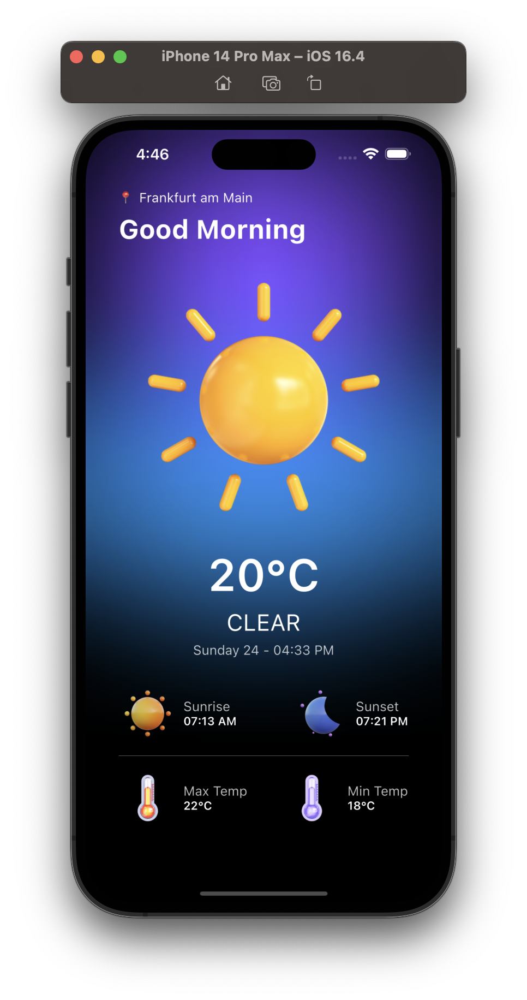
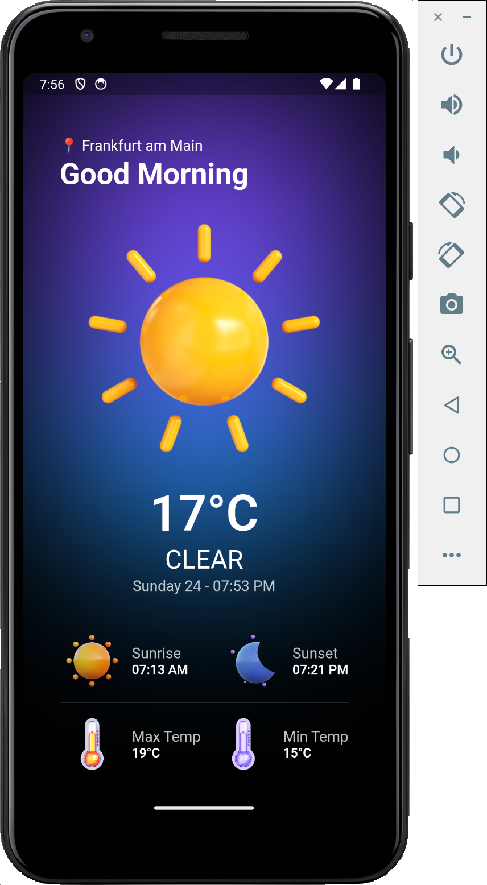

# Weather App

This is a simple weather app built with [Flutter](https://flutter.dev/). In order to get the app running you need an Api Key from the [OpenWeather API](https://openweathermap.org/api).

State Management: [BLoC](https://bloclibrary.dev/#/)

### screenshots

| iOS                                                       | Android                                                       |
| --------------------------------------------------------- | ------------------------------------------------------------- |
|  |  |

### todos

Following features are missing currently

- error handling
- landscape mode
- unit, widget, integration tests
- dynamic greeting depending on current time
- dynamic background colors depending on weather

### dependencies

- [intl](https://pub.dev/packages/intl)
- [weather](https://pub.dev/packages/weather)
- [equatable](https://pub.dev/packages/equatable)
- [geolocator](https://pub.dev/packages/geolocator)
- [flutter_bloc](https://pub.dev/packages/flutter_bloc)
- [flutter_dotenv](https://pub.dev/packages/flutter_dotenv)
